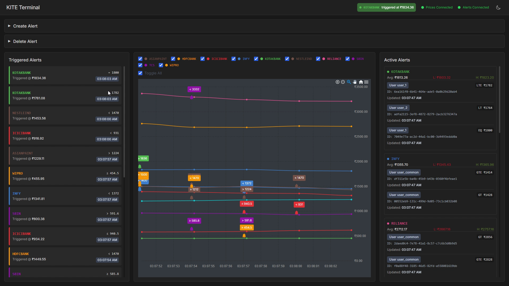

# 🚀 Kite-Alerts: A High-Throughput Distributed Stock Alerting System

Kite-Alerts is a **high-performance, real-time stock alert matching system** built with Kotlin and Spring Boot. This distributed system is designed to handle massive volumes of stock price data ("ticks") and match them against user-defined alerts with minimal latency.

## ✨ Key Features

- **Windowed Stream Aggregation** — Efficiently processes high-velocity tick data
- **Sharding with Consistent Hashing** — Horizontally scalable alert distribution
- **Multi-Layer Caching** — In-Memory, RocksDB, and PostgreSQL for optimal performance
- **Event-Driven Architecture** — Using ActiveMQ for reliable message delivery
- **Self-Healing** — Automatic reconciliation between cache layers

## 🏗️ Architecture


## 📸 Screenshots



## 🚀 Prerequisites

- **Java Development Kit (JDK)**: Version 21 or higher
- **Docker & Docker Compose** (or local PostgreSQL)
- **IntelliJ IDEA** (recommended) or other Java IDE
- **Git** for version control

## ⚡ Quick Start

### 1. Clone the repository

```bash
  git clone <your-repository-url>
  cd kite-alerts
```

### 2. Start PostgreSQL with Docker

```bash
  docker-compose up -d
```

### 3. Run the Application

```bash
  ./gradlew bootRun
```

### 4. Access the Real-Time UI

Open `src/main/resources/stock-alerts-graph-enhanced.html` in your browser to see:

- 📈 Real-time stock price charts
- 🔔 Active alerts and triggers
- ⚡ Live alert feed
- ➕ Interactive alert creation
- 🔧 Configuration UI

## Key parameters in `application-local.yml`

```yaml
tick-processor:
  mockProducer:
    frequencyMillis: 50      # Lower = faster tick generation
  windowAggregator:
    windowDurationMillis: 250  # Larger = bigger time windows
    listenerConcurrency: "5-10"

ams:
  shards:
    shard-alpha: "3-5"
  consistentHashing:
    virtualNodesPerShard: 3
  outbox:
    relayIntervalMs: 2000
  reconciliation:
    intervalMs: 30000
```

> Tip: Tweak `frequencyMillis` and `windowDurationMillis` to experiment with throughput and latency trade-offs.

## 🛠️ API Reference

### Core Endpoints

#### Create Alert
**POST** `/api/v1/alerts/create`  
`Content-Type: application/json`

```http
POST /api/v1/alerts/create
Content-Type: application/json

{
  "stockSymbol": "RELIANCE",
  "userId": "test-user",
  "priceThreshold": 2900.00,
  "conditionType": "GTE"
}
```

#### List Active Alerts
**GET** `/api/v1/alerts/active`

```http
GET /api/v1/alerts/active
```

#### Delete Alert
**DELETE** `/api/v1/alerts/delete/{alert-uuid}`

```http
DELETE /api/v1/alerts/delete/123e4567-e89b-12d3-a456-426614174000
```

### Debug Endpoints

#### Get alert from PostgreSQL (L3)
**GET** `/api/v1/alerts/postgres/{alert-uuid}`

```http
GET /api/v1/alerts/postgres/123e4567-e89b-12d3-a456-426614174000
```

#### Get alert from RocksDB (L2)
**GET** `/api/v1/alerts/rocksdb/shard-alpha/{alert-uuid}`

```http
GET /api/v1/alerts/rocksdb/shard-alpha/123e4567-e89b-12d3-a456-426614174000
```

#### List all alerts in shard cache
**GET** `/api/v1/alerts/rocksdb/shard-alpha/all`

```http
GET /api/v1/alerts/rocksdb/shard-alpha/all
```

## 🧪 Testing & Development

### Running Tests

```bash
  ./gradlew test
```

### Building the Project

```bash
  ./gradlew clean build
```

## Design Notes & Concepts

- **Windowed Aggregation**: Ticks are batched by time windows (configurable) to reduce matching overhead and amortize work over many ticks. Windows are designed for low-latency but can be tuned for throughput.
- **Sharding**: Alerts are sharded by consistent hashing (stock symbol, user ID, or a composite key). Virtual nodes help balance load and make rebalancing smoother.
- **Cache Layers**:
  - L1: In-memory (fastest, ephemeral)
  - L2: RocksDB (local persistent cache, shard-specific)
  - L3: PostgreSQL (source of truth)
- **Outbox Relay & Reconciliation**: The outbox periodically relays events to the message bus and reconciliation ensures eventual consistency across layers, repairing mismatches.
- **Self-Healing**: Periodic reconciliation scans for inconsistencies between L2 and L3 and repairs them automatically.

## Operational Tips

- Use container orchestration (Kubernetes) if you need auto-scaling and better resiliency across nodes.
- Monitor:
  - Windowing latency and tick backlog
  - RocksDB disk utilization per shard
  - Outbox queue size and relay success rate
- Consider using separate partitions or topics per shard in the message bus to allow parallel consumers and reduce head-of-line blocking.

## Troubleshooting

- If the UI shows stale data, verify:
  - The outbox relay is running and posting events to ActiveMQ
  - RocksDB shard caches are mounted and accessible
  - No network blocks exist between app and PostgreSQL
- If alerts are misfiring:
  - Check the alert condition logic (e.g., `GTE`/`LTE` boundaries)
  - Inspect the aggregation window size — too large windows delay matching
  - Validate sharding configuration and ensure consistent hashing keys haven't changed unexpectedly
